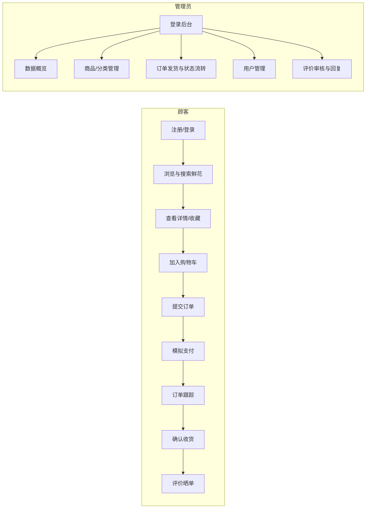
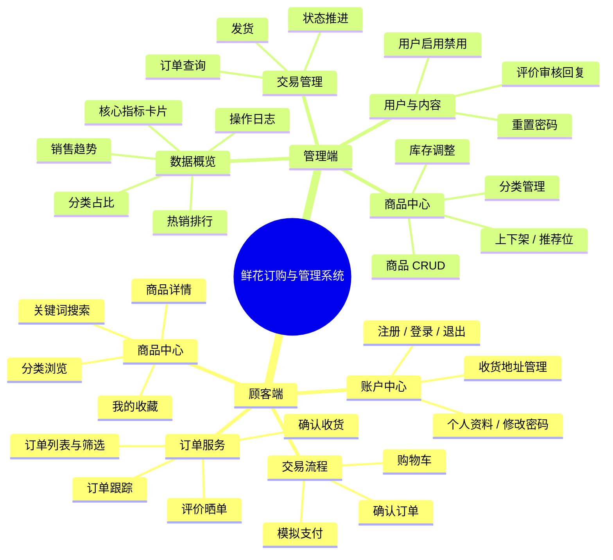
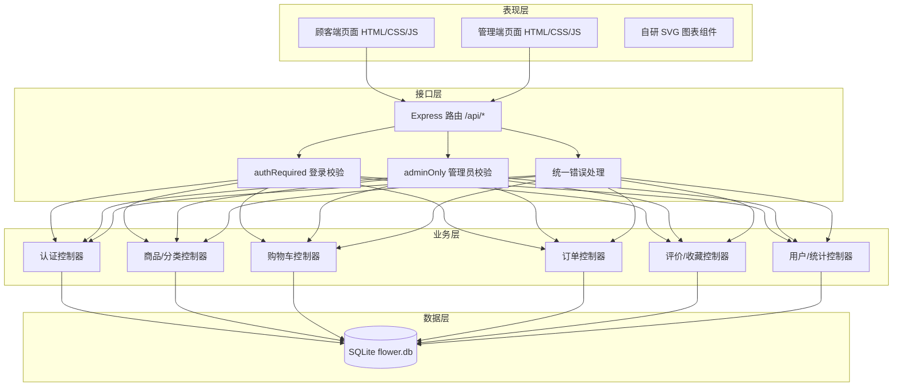
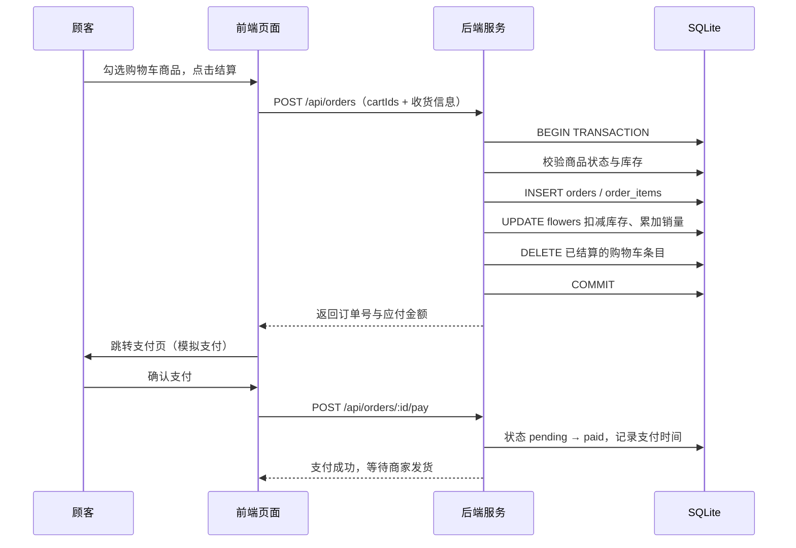

# 01 · 需求分析与系统设计

## 1.1 项目背景

随着生活水平提高，鲜花消费从"节日礼品"走向"日常悦己"，线下的时间与空间限制愈发明显。网上花店可以不受时间、空间限制，为用户提供方便快捷的选购与配送服务。本项目模拟网上花店销售业务，构建一套集鲜花浏览、预订、销售、购买、添加、删除、修改与库存管理于一体的系统。

## 1.2 需求规格

### 1.2.1 功能性需求

| 编号 | 需求 | 优先级 | 实现情况 |
| --- | --- | --- | --- |
| FR-01 | 用户注册、登录、退出 | 高 | ✅ 已完成，含格式校验与重复注册拦截 |
| FR-02 | 角色权限区分（顾客 / 管理员） | 高 | ✅ JWT + 中间件双重校验 |
| FR-03 | 鲜花分类浏览、关键词搜索 | 高 | ✅ 支持 6 类筛选、价格区间、6 种排序、分页 |
| FR-04 | 鲜花详情查看（花语/花材/包装） | 高 | ✅ 含评分、销量、库存、收藏 |
| FR-05 | 购物车（增删改、勾选结算） | 高 | ✅ 含库存校验与满减计算 |
| FR-06 | 下单（收货地址、备注、库存扣减） | 高 | ✅ 数据库事务保证一致性 |
| FR-07 | 模拟支付 | 中 | ✅ 3 种支付方式 + 倒计时 |
| FR-08 | 订单跟踪（物流时间轴） | 高 | ✅ 4 节点时间轴 |
| FR-09 | 订单评价 | 中 | ✅ 星级 + 文字，管理端可回复 |
| FR-10 | 商品管理（增删改查、上下架） | 高 | ✅ 含图片选择器、库存快捷调整 |
| FR-11 | 分类管理 | 中 | ✅ 含占用校验 |
| FR-12 | 订单管理（发货、状态流转） | 高 | ✅ 状态机约束 |
| FR-13 | 用户管理（启用禁用、重置密码） | 中 | ✅ 禁止禁用自身 |
| FR-14 | 经营数据概览 | 中 | ✅ 4 指标 + 4 图表 |
| FR-15 | 操作日志审计 | 低 | ✅ 关键操作留痕 |

### 1.2.2 非功能性需求

| 类型 | 要求 | 实现措施 |
| --- | --- | --- |
| 安全性 | 密码不明文存储、接口鉴权 | scrypt 加盐哈希、JWT 签名、角色中间件 |
| 可靠性 | 不超卖、状态不回退 | 事务扣减库存、状态机白名单校验 |
| 易用性 | 界面友好、操作直观 | 统一设计语言、Toast 提示、空状态引导 |
| 可维护性 | 分层清晰、易扩展 | 路由—控制器—工具三层结构，配置集中 |
| 可移植性 | 免安装、断网可演示 | 零 CDN 依赖、SQLite 单文件、本地 SVG 图片 |

## 1.3 角色与用例

## 1.4 系统功能模块图

## 1.5 系统架构

## 1.6 核心流程时序（下单）

## 1.7 技术选型说明

| 候选方案 | 选择 | 原因 |
| --- | --- | --- |
| 前端框架 Vue/React vs 原生 JS | **原生 JS** | 免构建、免打包，答辩现场直接打开即可演示，避免 npm 安装失败风险 |
| 图表 ECharts(CDN) vs 自研 SVG | **自研 SVG** | 断网环境下图表依然正常渲染，且体积极小 |
| 数据库 MySQL vs SQLite | **SQLite** | 零安装零配置，单文件便于随项目提交；SQL 语法与 MySQL 高度一致 |
| 会话 Session vs JWT | **JWT** | 前后端分离、接口无状态，便于扩展小程序/APP 端 |
| 密码 MD5 vs scrypt | **scrypt** | Node 内置抗 GPU 暴力破解的哈希算法，安全性更高 |
