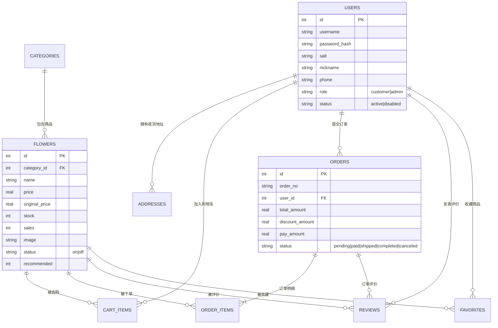

# 02 · 数据库设计

- 数据库：SQLite 3（文件：`server/data/flower.db`）
- 建表脚本：`server/src/db/schema.sql`（全部使用 `IF NOT EXISTS`，重复启动不破坏数据）
- 演示数据：`server/src/db/seed.js`（6 个分类、18 款鲜花、5 个账号、32 笔历史订单）
- 外键约束：连接时执行 `PRAGMA foreign_keys = ON`

## 2.1 E-R 图

## 2.2 表清单

| 序号 | 表名 | 中文名 | 记录数（演示） | 说明 |
| --- | --- | --- | --- | --- |
| 1 | users | 用户表 | 5 | 顾客与管理员共用，通过 role 区分 |
| 2 | addresses | 收货地址表 | 5 | 支持多地址与默认地址 |
| 3 | categories | 鲜花分类表 | 6 | 爱情玫瑰、生日祝福、感恩母爱、清新百合、永生花盒、开业庆典 |
| 4 | flowers | 鲜花商品表 | 18 | 价格、库存、销量、花语、花材、包装 |
| 5 | cart_items | 购物车表 | 2 | `UNIQUE(user_id, flower_id)` 防止重复行 |
| 6 | orders | 订单表 | 32 | 含金额、状态、物流、四个时间戳 |
| 7 | order_items | 订单明细表 | 40+ | 下单时快照商品名与价格 |
| 8 | reviews | 评价表 | 8+ | `UNIQUE(order_id, flower_id)`，每单每商品仅评一次 |
| 9 | favorites | 收藏表 | 2 | `UNIQUE(user_id, flower_id)` |
| 10 | operation_logs | 操作日志表 | 2+ | 后台关键操作留痕 |

## 2.3 关键表结构

### users（用户表）

| 字段 | 类型 | 约束 | 说明 |
| --- | --- | --- | --- |
| id | INTEGER | PK 自增 | 用户编号 |
| username | TEXT | 唯一、非空 | 登录账号，3-20 位字母开头 |
| password_hash | TEXT | 非空 | scrypt 摘要（`$scrypt$...` 格式） |
| salt | TEXT | 非空 | 随机盐值，16 字节 Hex |
| nickname | TEXT | 非空 | 昵称 |
| phone / email / avatar | TEXT | — | 联系方式与头像 |
| role | TEXT | 默认 customer | `customer` / `admin` |
| status | TEXT | 默认 active | `active` / `disabled` |
| created_at / updated_at | TEXT | — | 本地时间字符串 |

### flowers（商品表）

| 字段 | 类型 | 说明 |
| --- | --- | --- |
| category_id | INTEGER | 外键 → categories.id |
| price / original_price | REAL | 现价 / 划线原价 |
| stock / sales | INTEGER | 库存 / 累计销量（下单事务内同步更新） |
| image | TEXT | 主图路径，如 `/assets/images/flowers/flower-01.svg` |
| material / flower_language / packing | TEXT | 花材 / 花语 / 包装 |
| status | TEXT | `on` 上架、`off` 下架（下架商品不在前台展示） |
| recommended | INTEGER | 1 表示首页推荐位 |
| rating | REAL | 综合评分冗余字段，列表展示用 |

### orders（订单表）

| 字段 | 类型 | 说明 |
| --- | --- | --- |
| order_no | TEXT 唯一 | 业务订单号，格式 `FL年月日+6位序号+随机` |
| total_amount / discount_amount / pay_amount | REAL | 商品总额 / 优惠 / 实付 |
| status | TEXT | `pending` 待付款、`paid` 待发货、`shipped` 待收货、`completed` 已完成、`canceled` 已取消 |
| pay_method | TEXT | 模拟支付方式 |
| express_company / express_no | TEXT | 物流公司与运单号 |
| created_at / paid_at / shipped_at / completed_at / canceled_at | TEXT | 状态时间戳，用于生成物流时间轴 |

## 2.4 设计要点

1. **订单明细快照**：`order_items` 保存下单时的商品名称、单价、图片，商品后续改价/改名不影响历史订单，符合电商系统通行做法。
2. **库存一致性**：下单与取消订单均在事务中完成，`stock` 与 `sales` 同步增减，避免超卖与销量错乱。
3. **唯一性约束**：购物车、收藏、评价均设置联合唯一键，从数据库层面杜绝重复数据。
4. **索引优化**：对 `flowers.category_id`、`flowers.status`、`orders.user_id`、`orders.status`、`order_items.order_id` 建立索引，提升列表查询与统计性能。
5. **软删除策略**：商品删除前校验是否产生订单或评价，若已产生则提示改为"下架"，保护历史数据完整性。
6. **轻量迁移**：`db/index.js` 中的 `migrate()` 会在启动时检测并补充新增列（如 `orders.discount_amount`、`flowers.rating`），避免旧库升级失败。
